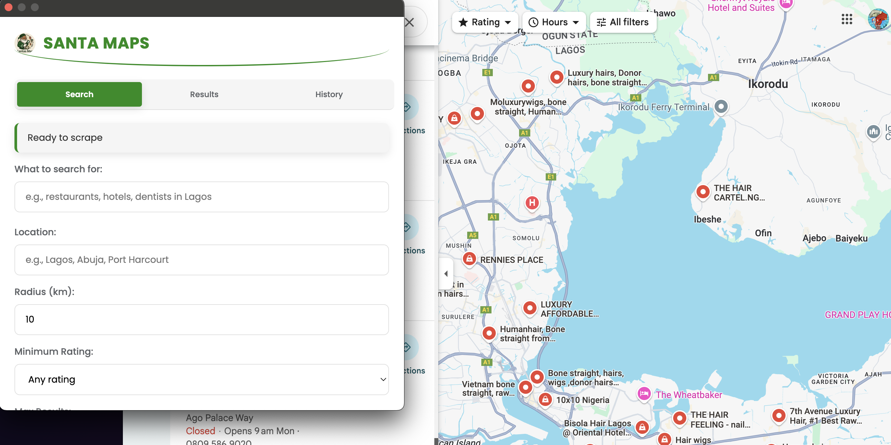

---

# 📍 Santa Maps - Advanced Google Maps Scraper

**Santa Maps** is a powerful Chrome extension that helps you extract business data from Google Maps with ease. Designed for researchers, marketers, and business analysts, this tool provides a user-friendly interface to scrape and export valuable business information.



## ✨ Features

- **Comprehensive Data Collection**:
  - Business names, ratings, contact info
  - Addresses, websites, operating hours
  - Categories and more

- **Smart Search Filters**:
  - Location-based searching
  - Radius limitation (in km)
  - Minimum rating requirements
  - Maximum results control

- **Flexible Export Options**:
  - CSV and JSON export formats
  - Customizable filename
  - Selectable data fields

- **User-Friendly Interface**:
  - Tab-based navigation (Search/Results/History)
  - Real-time progress tracking
  - Search history preservation

- **Optimized Performance**:
  - Responsive design (min-width: 700px)
  - Smooth animations and transitions
  - Clean, modern UI with Santa theme

## 🛠️ Installation

1. Clone this repository:
   ```bash
   git clone https://github.com/SanCrystal/Santa-Maps---Google-Maps-Data-Scraper-Extension.git
   ```

2. Load the extension in Chrome:
   - Open `chrome://extensions/`
   - Enable "Developer mode"
   - Click "Load unpacked" and select the extension directory

## � Usage

1. Open Google Maps in Chrome
2. Click the Santa Maps extension icon
3. Set your search parameters:
   - Enter search query and location
   - Adjust radius and rating filters
   - Select data fields to collect
4. Click "Start Search" then "Start Scraping"
5. View and export your results in CSV/JSON format

## 📂 File Structure

```
Santa-Maps---Google-Maps-Data-Scraper-Extension/
├── popup.html       # Main extension interface
├── popup.js         # Extension logic and functionality
├── map.png          # Extension icon
├── manifest.json    # Extension metadata
├── LICENSE          # License information
├── .gitignore       # Git ignore file
├── shots.png        # Screenshot
└── README.md        # This documentation
```

## ⚙️ Technical Details

- **Frontend**: HTML5, CSS3 (with modern Flexbox/Grid)
- **Styling**: Clean Santa-themed UI with green/white color scheme
- **Compatibility**: Chrome extension manifest v3
- **Responsive**: Adapts to different screen sizes (600px+)

## 🤝 Contributing

Contributions are welcome! Please open an issue or submit a pull request for any improvements.

## 📜 License

MIT © [Santa]

---
